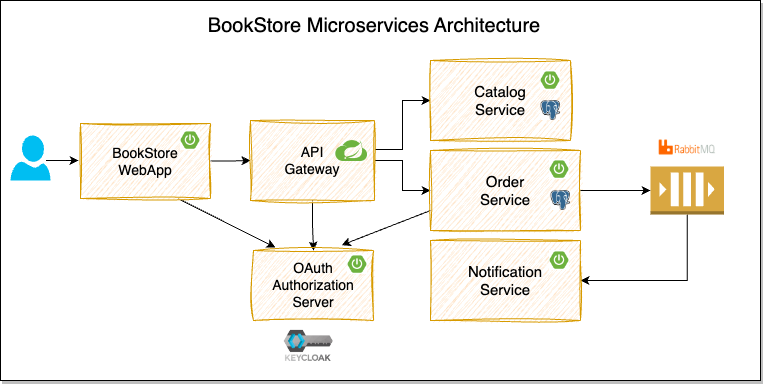

# BookStore Microservices




## Prerequisites
* JDK 21 or later. Recommend using [SDKMAN](https://sdkman.io/).
* Install [Docker](https://docs.docker.com/engine/install/). Recommend using [OrbStack](https://orbstack.dev/).
* Install [IntelliJ IDEA](https://www.jetbrains.com/idea) or any of your favorite IDE.
* Install [Insomnia](https://insomnia.rest/) or any REST Client.
* Install [go-task](https://task-zh.readthedocs.io/zh-cn/latest) for managing scripts.

## How to get started?

```shell
$ git clone https://github.com/chensoul/bookstore-microservice.git
$ cd bookstore-microservice

# brew tap sdkman/tap
# brew install sdkman-cli
$ sdk env install

# brew install go-task/tap/go-task
$ task test build

# Run application by docker
$ task start

# Run application by ide
# Run/Debug XxxApplication.java from your IDE.
```

## References

- https://github.com/feature-tracker
- https://github.com/SaiUpadhyayula/spring-boot-3-microservices-course
